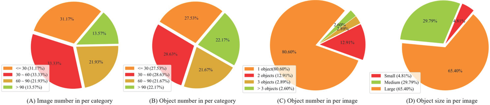
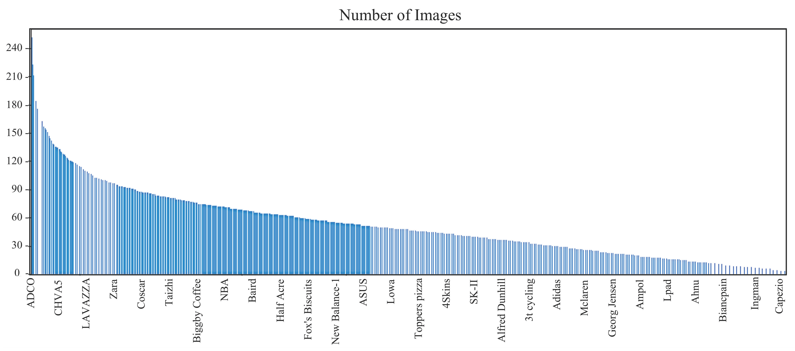
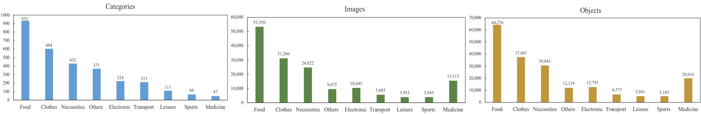

# 
 LogoDet-3K: A Large-Scale Image Dataset for Logo Detection 

## LogoDet-3K-Dataset

## LogoDet-3K Dataset Description
In this work, we introduce LogoDet-3K, the largest logo detection dataset with full annotation, which has 3,000 logo categories, about 200,000 manually annotated logo objects and 158,652 images. LogoDet-3K creates a more challenging benchmark for logo detection, for its higher comprehensive coverage and wider variety in both logo categories and annotated objects compared with existing datasets. 
The statistic comparison of 9 super categories from LogoDet-3K is shown as follows,

| Root Category | Sub-Category  | Images|Objects|
| ------------- |:-------------:| -----:| -----:|
| Food          |  932 |   53,350    | 64,276 |
| Clothes       |  604 |   31,266    | 37,601 |
| Necessities   |  432 |   24,822    | 30,643 |
| Others        |  371 |   15,513    | 20,016 |
| Electronic    |  224 |   9,675     | 12,139 |
|Transportation |  213 |   10,445    | 12,791 |
|Leisure        |  111 |   5,685     |  6,573 |
|Sports         |  66  |   3,945     |  5,041 |
|Medical        |  47  |   3,945     |  5,185 |
|Total          |  3,000 |   158,652 |194,261 |

## LogoDet-3K Dataset Detailed Statistics
The figure showns the detailed statistics of LogoDet-3K about Image and object distribution in per category, and the number
of objects in per image and object size in per image.

The sorted distribution of images for each logo in LogoDet-3K is shown the figure. We can see that imbalanced distribution across
different logo categories are one characteristic of LogoDet-3K, posing a challenge for effective logo detection with few samples.

The figure shows the distributions of categories, images and objects from LogoDet-3K on super-classes.

## Download Dataset Links

Server link: 123.57.42.89/Dataset_ict/LogoDet-3K.zip

Baidu Drive link: https://pan.baidu.com/share/init?surl=ECJ4zOurhMzBgDZ11ekxQA password:1234

## Download pertrained model Links

Google Drive link: https://drive.google.com/file/d/1GOYqRy7yoBVAt9Ih375NWtoZZTXN6OET/view?usp=sharing

